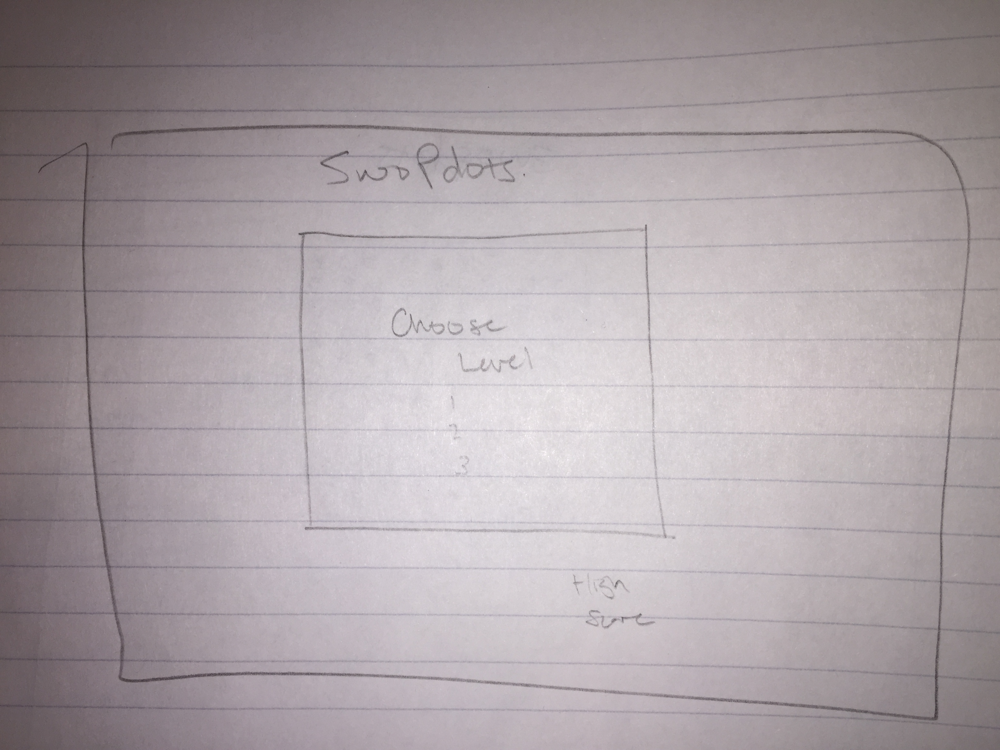
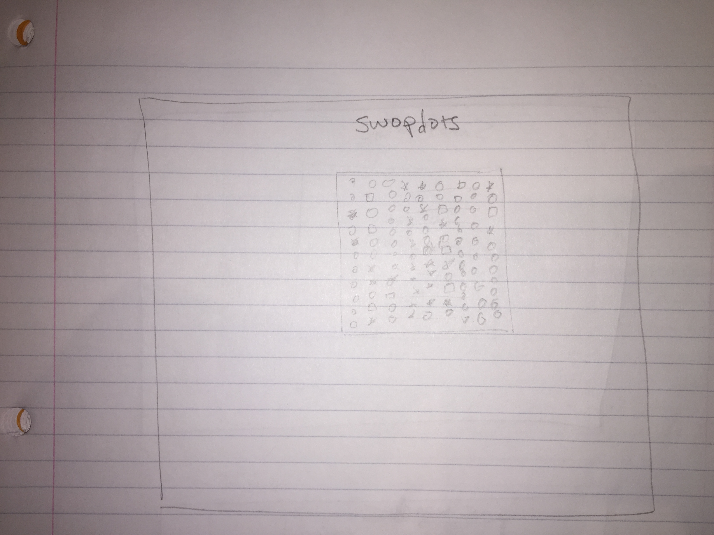
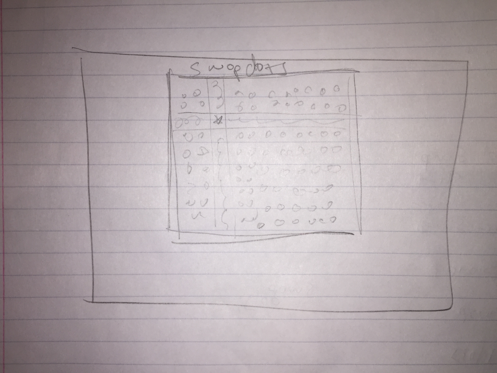

# swoPdotz

## Minimum Viable Product (MVP)

swoPdotz is a fun, addictive javascript game inspired by Bejeweled, Candy Crush, and Dots.

- [ ] Hosting online
- [ ] Bug-free Gameplay
- [ ] Intuitive UI/UX
- [ ] Clean and elegant CSS styling
- [ ] Organized file structure
- [ ] Tile swapping
  - [ ] Easy to use, clear
  - [ ] Well Styled
- [ ] "Explosions"
  - [ ] Explode in correct direction
  - [ ] Styled with clean transition
- [ ] Different Tiles/Symbols
  - [ ] Have different explosion functions
  - [ ] All Styled appropriately and cohesively
- [ ] BONUS: Add high score persistence with small database and backend

## Technologies, Libraries, APIs

 - Javascript
 - React.js
 - SASS
 - HTML
 - BONUS: SQL

swoPdotz will be implementing the technologies listed above to implement a seamless web app that is easy to use, quick, and exciting. The challenges will be in making gameplay smooth and making sure the simplicity of the design doesn't make the game look too juvenile. Instead, the game should design should be elegant, with colors reminiscent of Dots.

## Wireframes

Entry:

Main Gameplay:

Tile Explosion:

## Backend

The backend will be a bonus allowing users to save their high scores. It will consist of one table:

### high_scores
column name    | data type  | details
---------------|------------|-----------------------
id             | integer    | not null, primary key
username       | string     | not null
score          | integer    |

## Implementation Timeline

### Day One

- [x] Create file structure
- [x] Assemble colors and symbols
- [x] Implement basic tile swapping
- [x] Implement simple and elegant CSS

### Day Two

- [x] Develop game play
  - [x] Restrict tile swapping to appropriate pieces
  - [x] Add at least two different types of combinations
  - [ ] Create explosion CSS
- [ ] Adjust CSS, ensuring modernity

### Day Three

- [ ] Develop game play
  - [ ] Add obstacles
  - [ ] Add levels/algorithm for levels to be created dynamically
  - [ ] Add new types of combinations/explosions
- [ ] Continue to perfect CSS

### BONUS

- [ ] Add backend
- [ ] Create high score table
- [ ] Make sure game works on mobile devices

## Final Checklist

### Live Project

- [ ] Includes links to your Portfolio, Github and LinkedIn.
- [ ] Landing page/modal with obvious, clear instructions.
- [ ] Interactivity of some kind.
- [ ] Well styled, clean frontend.
- [ ] If it has music, the option to mute or stop it.
- [ ] Hosted from your portfolio site on GitHub pages.

### Repo and README

- [ ] Link to live version.
- [ ] Instructions on how to play/use the project.
- [ ] List of techs/languages/plugins/APIs used.
- [ ] Technical implementation details with code snippets (make sure it looks good).
- [ ] To-dos/future features.
- [ ] No .DS_Stores / debuggers / console.logs.
- [ ] Organize into /assets and /lib.
