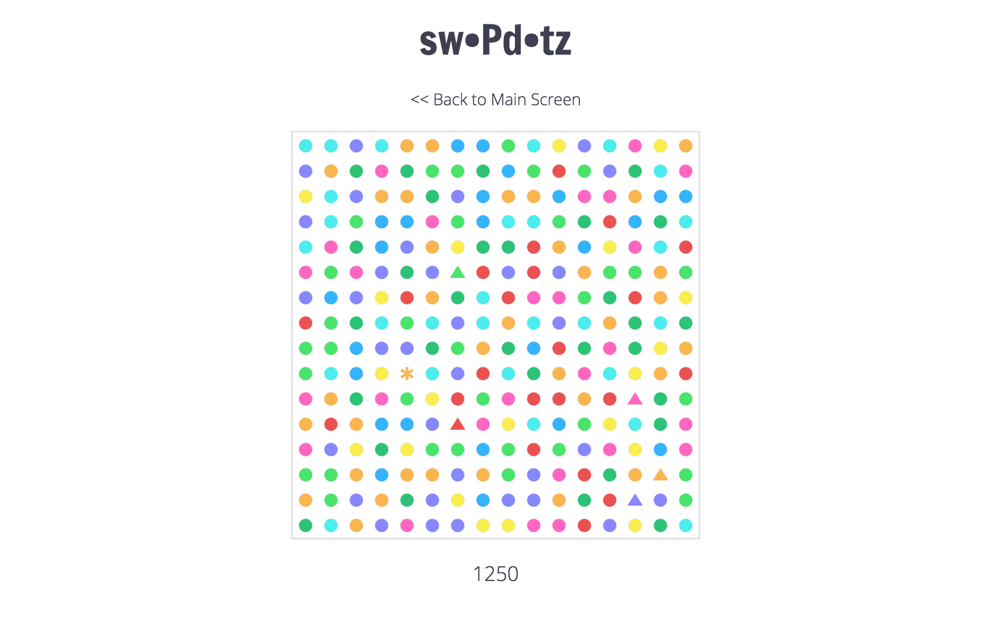

# swoPdotz

An addictive JavaScript browser game inspired by Dots and Candy Crush, implementing React.js and JavaScript.


<!--  -->

## Features and Technologies

- React.js
- JavaScript
- `react-dnd`

## How to play

Swap contiguous dots with each other to create chains of like colored dots. The dots will combine to form a more powerful dot, the more dots, the more powerful the resulting dot. Use the more powerful dots to explode dots and earn points.


## Dot combinations

To ensure DRY code, rather than creating several functions to check for lined up dots, I created one function that you could pass an x, y, delta, and num (in a row) to and it would appropriately call the remove dot function when it found dots that needed to be eliminated, and create a new dot in their place that corresponded with the "num" in an object that matched different size combinations with their appropriate dot constructors.

```JavaScript

Board.prototype.checkNumInDelta = function (x, y, num, dPos) {
  const dx = dPos[0];
  const dy = dPos[1];
  const size = this.size;

  if (this.grid[x][y] && this.grid[x][y].id && (x + ((num - 1) * dx) < size) && (y + ((num - 1) * dy) < size)) {
    const initColor = this.grid[x][y].color;
    let sameColor = true;

    for (var i = 0; i < num && sameColor; i++) {
      if (!this.grid[x + dx * i][y + dy * i] ||
        this.grid[x + dx * i][y + dy * i].color !== initColor) {
        sameColor = false;
      }
    }

    if (sameColor === true && i === num) {
      for (var j = 0; j < num; j++) {
        if (Math.floor(num / 2) === j) {
          this.replaceDot(x + dx * j, y + dy * j, dotNumConv[num]);
        } else {
          this.removeDot(x + dx * j, y + dy * j);
        }
      }
      this.score += scoreConv[num];
    }
  }
};


```


## Custom Flux-Like Cycle

One of the challenges I experienced early on in creating swoPdotz was with my implementation of Flux. One of the challenges of Flux, is that passing callbacks becomes very challenging and I was constantly rewriting code to fit within a framework that I realized just wasn't right for this project. But I wanted to maintain the consistent data flow that the flux cycle provides so, in the spirit of flux, I created my own cycle! I made a "Liaison" function that was responsible for all of what flux would've done in its place. Liaison holds a single instance of a Board and has 'public' actions which are accessed from the React components. Liaison then appropriately times functions and sends callbacks to the board which then is sent back to Liaison and it is able to broadcast changes to all the listeners that have been set on it, much like a Flux Store would've. A game like swoPdotz requires fairly specific timing to ensure that changes are happening quickly, but also visibly for the user to interact with. By using Liaison I was able to implement several more interesting CSS transitions that required JavaScript timeouts to implement.

### Dropping Dot Animation


## Custom Deep Dup Function

In order to help ensure that the board stored in Liaison wasn't being altered at all by the React components it was being sent to, I created a custom, recursive, deep dup function that handles all the data structures used in swoPdotz including Objects and Arrays. As you can see from the code snippet below, it was important to put the if for Arrays above that of Objects. Why? Well, it turns out that Arrays are also Objects (duh!) but of course, when I didn't have this, it created some interesting results.

``` JavaScript

function objDeepDup(obj) {
  let newObject = {};

  Object.keys(obj).forEach((key) => {
    newObject[key] = unknwnTypeDup(obj[key]);
  });

  return newObject;
}

function unknwnTypeDup(val) {
  if (val instanceof Array) {
    return val.map((el) => unknwnTypeDup(el));
  } else if (val instanceof Object) {
    return objDeepDup(val);
  } else {
    return val;
  }
}

```


## CSS explosions

One of my main goals in making swoPdotz was to maintain a simple and elegant design throughout. One of the challenges I encountered with this was in crafting explosions that looked clean, and fit into the design of the rest of the app. In my research I found a great example that I wanted to implement (#). When I first began to integrate this I discovered one of the main design flaws of their solution: the randomness that they were trying to attain with the particles is not possible with SCSS. I say this because, once the SCSS is compiled into CSS the random function is called and now these values are all set. If you're looking at just one explosion with 50 particles this doesn't seem to be such a big deal, but when you have as many as 256 explosions of 6 particles back to back the lack of actual randomness ends up looking pretty hokey. To remedy this I extracted my particles into their own React component class and had them be responsible on their own for adding inline styling to themselves at the appropriate moment so the explosion would look as random, and therefore as realistic, as possible each time.

```JavaScript
// particle.jsx

getInitialState() {
  return({ animationClass: 'start',
    style: {
      top: '50%',
      left: '50%',
    } });
},

componentDidMount () {
  const that = this;
  setTimeout((() => {
    if (that.isMounted()) {
      that.setState( {
        animationClass: 'finish',
        style:
        { top: `${Math.floor(Math.random() * 120 - 62)}px`,
          left: `${Math.floor(Math.random() * 120 - 62)}px`,
        }});
    }
  }), 10);
}

```

```CSS
/* application.scss */

.particle {
  border-radius: 50%;
  position: absolute;
  box-shadow: 1px 1px 2px white;
}


.particle.finish {
  transition: all .6s linear, background-color .01s linear;
  width: 10px;
  height: 10px;
  opacity: 0;
}

.particle.start {
  width: 2px;
  height: 2px;
  opacity: 1;
  background-color: white;
}
```

### Exploding Dot Animation


## In the Future...

swoPdotz has been incredibly fun to work on and I look forward to being able to continue to work on it in the future. Here are some plans I have for the future of swoPdotz:

- Backend to persist High Scores
- Goal based levels
- Mobile device (touch screen) compatibility
